# 🎬 App Movie - Movie Booking Web Clone

Một website đặt vé xem phim lấy cảm hứng từ các hệ thống rạp chiếu hiện đại, tích hợp thanh toán qua **PayOS**. Dự án gồm **Frontend** (Next.js) và **Backend** (NestJS + MySQL).

> 🚧 **Lưu ý:** Đây là dự án cá nhân nhằm luyện tập, chưa triển khai đầy đủ xác thực & bảo mật mức production.
---
## 🚀 Tính năng

- 🎞️ Danh sách phim và thông tin lịch chiếu
- 🪑 Đặt ghế và thanh toán vé trực tuyến
- 💳 Tích hợp thanh toán qua PayOS
- 🔒 Xác thực người dùng cơ bản
- ✅ Giao diện responsive, hiện đại
- 🔥 Thông báo người dùng với Toast
- 📦 Kiến trúc chia module rõ ràng (client/server)
---
## 📸 Giao diện demo

### 🏠 Trang chủ
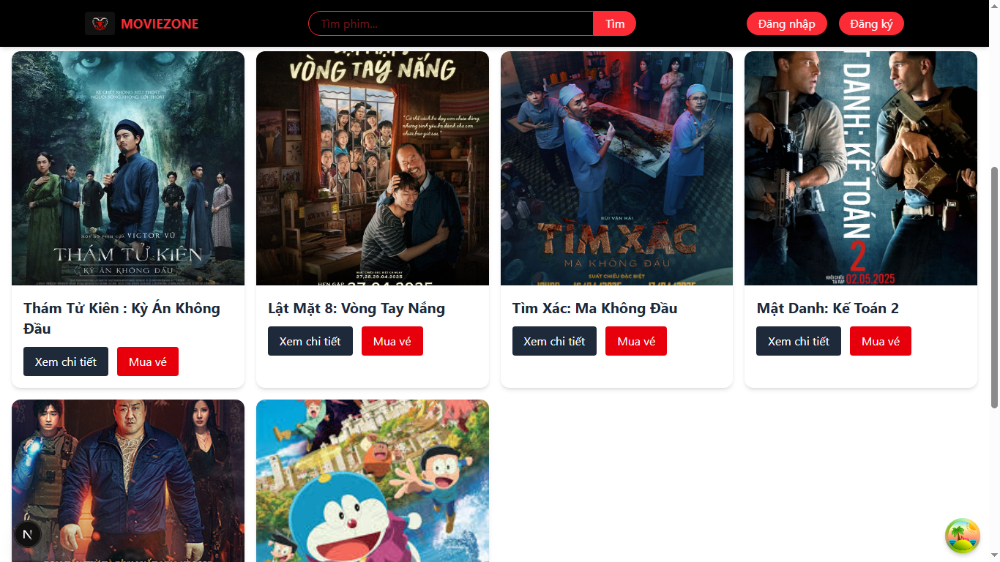
### 🔑 Đăng nhập
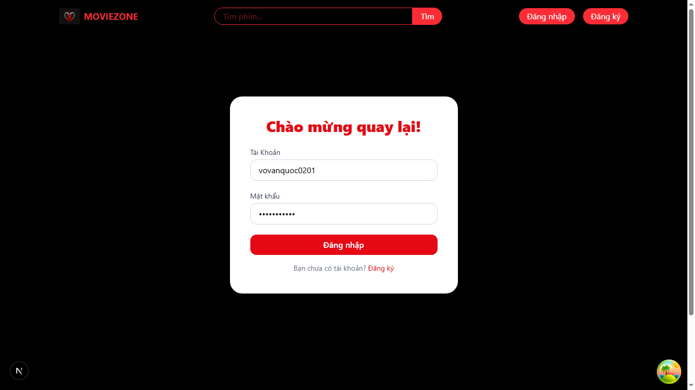
### 🎟️ Trang chi tiết phim và lịch chiếu
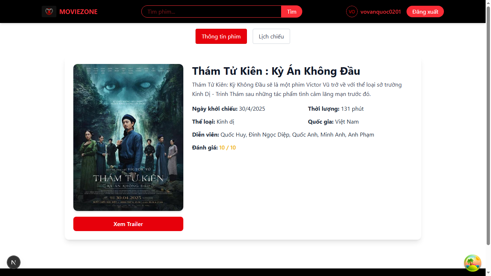
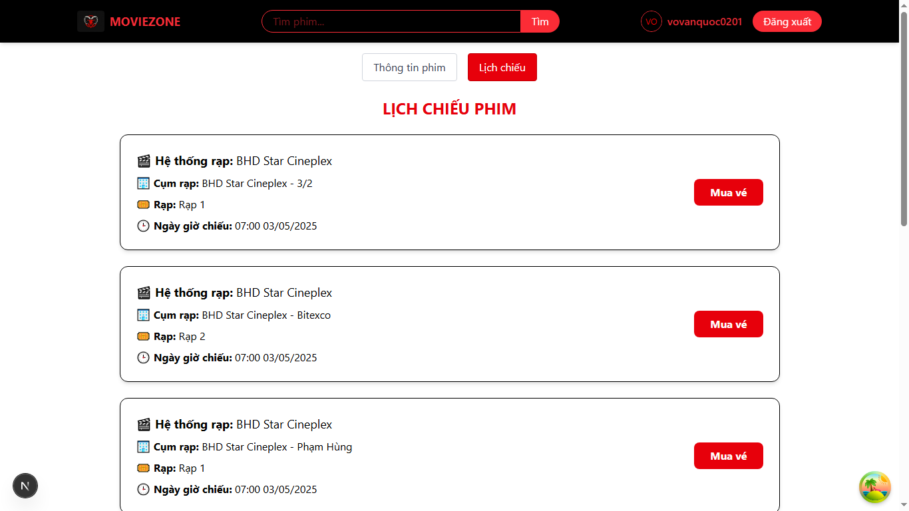
### 💳 Đặt vé
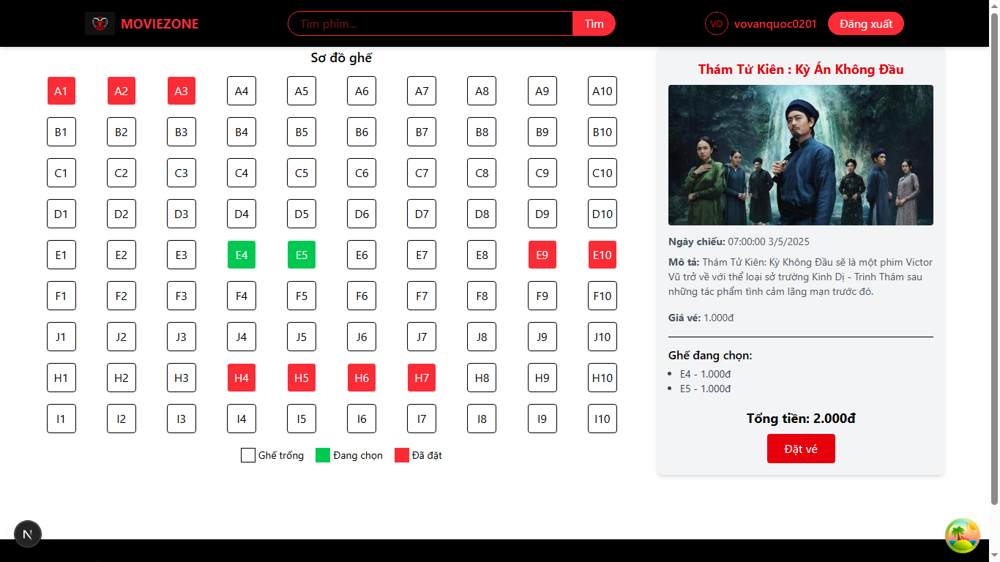
### 💳 Thanh toán
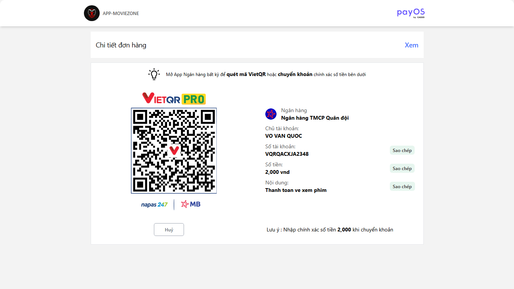
### 🏠 Module Admin
### 🏠 Trang quản lý người dùng
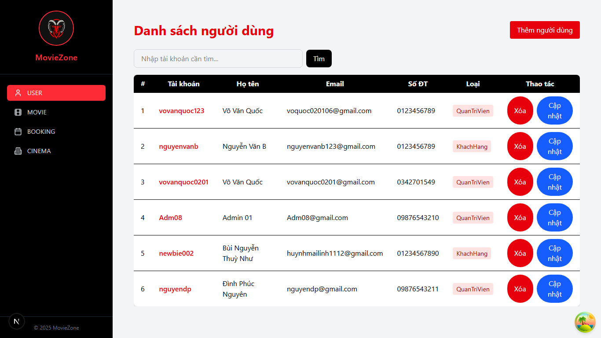
### 🏠 Trang quản lý phim
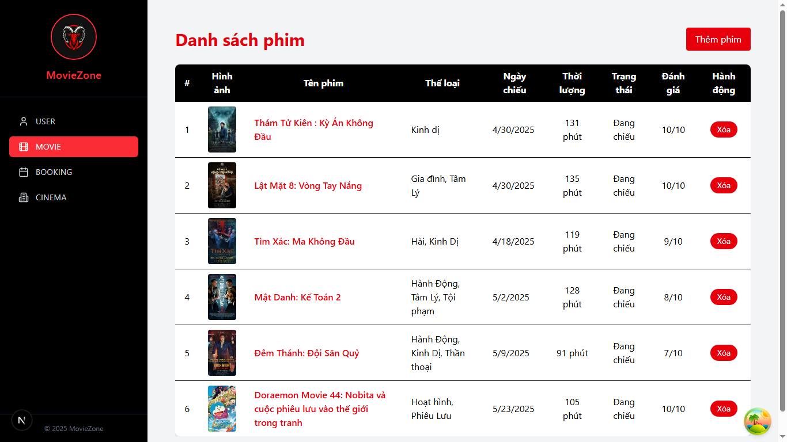
### 🏠 Trang quản lý lịch chiếu
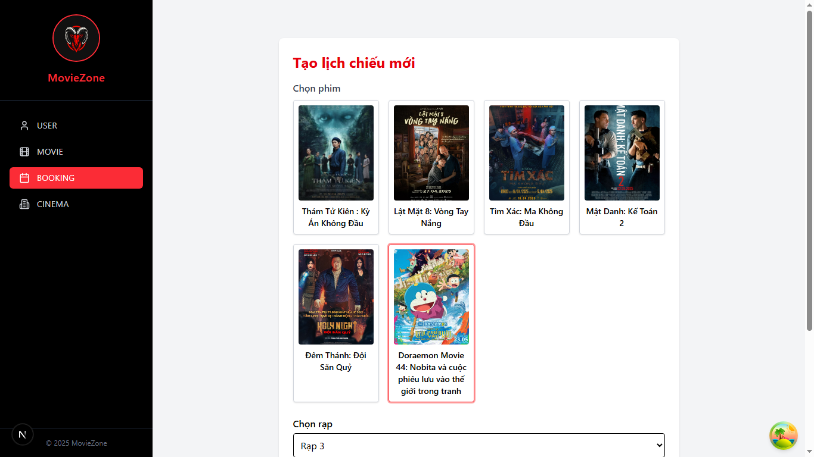
### 🏠 Trang quản lý rạp
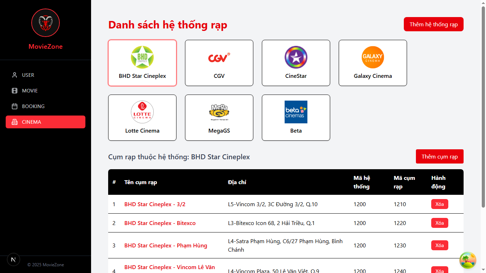
### 🛠️ Swagger BE
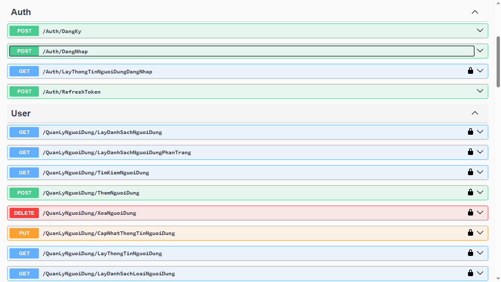
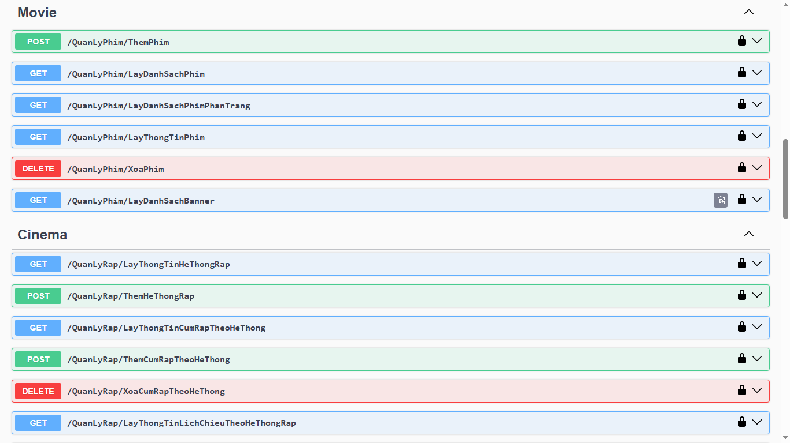
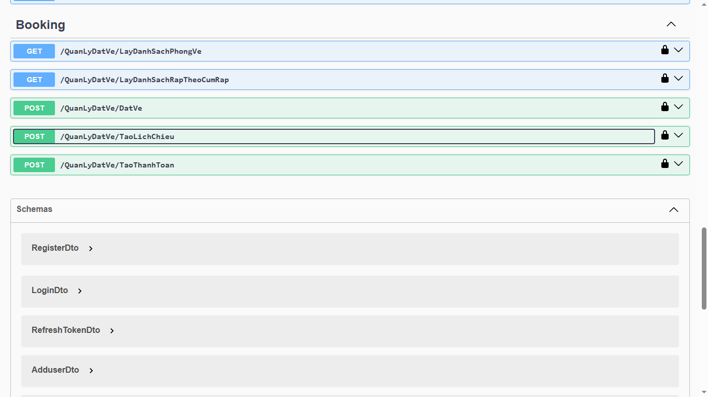
---

## 🧰 Tech Stack

### 💻 Frontend
- **Next.js** (App Router)
- **Tailwind CSS**
- **React Hook Form**
- **Axios**
- **React Toastify**
- **Zustand / Hook-based State**

### 🔧 Backend
- **NestJS** (Node.js Framework)
- **MySQL + Prisma**
- **Dotenv config**
- **Swagger**
- **PayOS API integration**

---

## 📁 Cấu trúc thư mục
AppMovie/
├── FE_Movie_Node50/ # Frontend với Next.js
└── BE_Movie_Node50/ # Backend với NestJS + MySQL

---

## ⚙️ Hướng dẫn khởi chạy

### 1. Clone Repo
cmd
git clone https://github.com/Vanquoc0201/AppMovie_NextJS.git
cd AppMovie_NextJS
### 2. Run BE
start image docker
config db_movie to db_movie-export because it has data
cd BE_Movie_Node50
npm install
npm run start:dev
### 3. Run FE
cd FE_Movie_Node50
npm install
npm run dev

